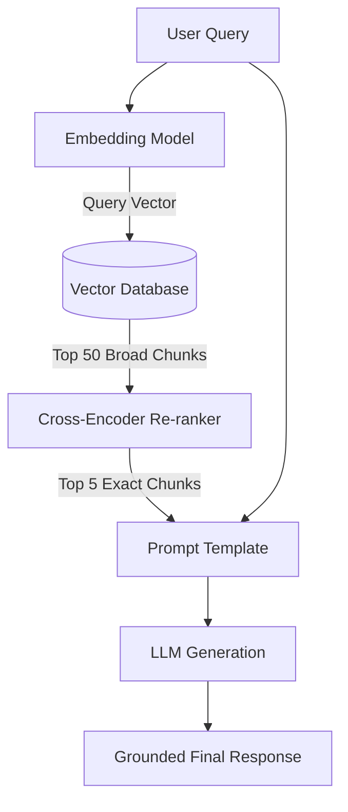

# How to Implement Retrieval Augmented Generation: 2025 Guide

*Learn how to implement retrieval augmented generation with our technical roadmap. Connect private data to LLMs securely and reduce AI hallucinations today.*

## The Evolution of RAG in 2025: Beyond Keyword Matching

Historically, early enterprise search relied on keyword matching (TF-IDF or BM25). If a user searched for "Q3 revenue drop," the system looked for those exact words. Early RAG implementations improved this by introducing semantic retrieval, converting text into dense vectors to capture meaning.

Yet, naive RAG architectures—where documents are chunked indiscriminately, embedded, and dumped into a prompt—routinely fail in production. They suffer from "lost in the middle" syndrome (where LLMs ignore context in the middle of a prompt) and retrieve documents that are semantically similar but contextually irrelevant.

Today's enterprise deployments have evolved into two-stage retrieval systems and agentic workflows. They prioritize sophisticated chunking, high-dimensional vector databases, and secondary re-ranking to ensure only the highest-signal data reaches the LLM. Furthermore, linear RAG pipelines are increasingly being replaced by agentic architectures. Instead of blindly executing a retrieve-then-generate sequence, agentic frameworks empower the LLM to evaluate the user query, dynamically decide if retrieval is necessary, determine which vector index to query, and loop back to self-correct if the retrieved context is insufficient.

## Step-by-Step Technical Implementation Roadmap

Building a production-ready RAG pipeline requires integrating several specialized components. Below is the technical roadmap for assembling these layers using industry-standard frameworks.

### 1. Data Ingestion and Advanced Chunking Strategies

LLMs have finite context windows, and feeding them entire databases is both computationally prohibitive and highly inaccurate. Data must be broken down into manageable pieces, a process known as chunking.

Poor chunking destroys context. If a chunk splits a sentence in half, or separates a financial figure from its parent paragraph, the embedding model will generate a meaningless vector.

Instead of basic character splitting, modern pipelines utilize semantic or recursive chunking. Using orchestration frameworks like LangChain, the `RecursiveCharacterTextSplitter` is the industry standard. It attempts to split text using a hierarchy of separators (paragraphs, then sentences, then words) to keep related text together.

When defining your chunking strategy, two parameters are critical:
* **Chunk Size:** Typically measured in tokens (e.g., 512 or 1024 tokens). Smaller chunks yield more precise retrieval but lack surrounding context. Larger chunks provide deep context but dilute the specific answer and consume more prompt space.
* **Chunk Overlap:** To prevent context from being lost at the boundary of a chunk, introduce an overlap (e.g., 50 to 100 tokens). This ensures that if a critical concept spans two chunks, both retain enough context to be retrieved.

### 2. Selecting Embedding Models and Vector Databases

Once text is chunked, it must be converted into numerical arrays (vectors) via an embedding model. The choice of embedding model dictates the dimensions of your vectors, which directly impacts storage costs and search latency.

OpenAI's `text-embedding-3-large` or `text-embedding-3-small` are common for managed architectures, offering strong multilingual support and adjustable dimensions. For highly sensitive or offline environments, open-source models like BAAI's `bge-large-en` or Nomic's `nomic-embed-text` can be run locally.

These vectors are then stored in a vector database. Your choice here depends heavily on scale and infrastructure preferences:
* **Pinecone:** A fully managed, serverless vector database. Pinecone is ideal for teams optimizing for developer experience and fast time-to-market. It abstracts away infrastructure management and scales seamlessly, making it a favorite for SaaS applications.
* **Milvus:** An open-source, highly scalable vector database designed for massive enterprise workloads. Milvus is better suited for teams with dedicated MLOps resources who need to deploy within a virtual private cloud (VPC) or manage billions of vectors with complex clustering topologies.

When configuring your vector index, you must choose a distance metric to calculate similarity. **Cosine Similarity** measures the angle between vectors, making it excellent for comparing document meaning regardless of document length. **Inner Product** (or Dot Product) is often faster and preferable if your embedding model produces normalized vectors.

### 3. Semantic Retrieval and Cross-Encoder Re-ranking

The most critical upgrade to a 2025 RAG architecture is the implementation of a two-stage retrieval pipeline. Basic semantic retrieval is fast but imprecise. It retrieves documents based purely on vector proximity.

To improve accuracy, you must add a re-ranking step. In a two-stage pipeline:
1. **First-pass retrieval:** The vector database rapidly returns the top 20 to 50 broadly relevant chunks using Cosine Similarity.
2. **Second-pass re-ranking:** A specialized Cross-Encoder model (such as Cohere Rerank or an open-source alternative like `bge-reranker`) evaluates the exact user query against each retrieved chunk. The cross-encoder outputs a precise relevance score, reordering the chunks so the top 3 to 5 most accurate pieces of context are isolated.

Re-ranking adds marginal latency (often less than 100 milliseconds) but drastically reduces LLM hallucinations by ensuring only the highest-fidelity context is injected into the final prompt.

### 4. Generation and Integration via LangChain

The final step is orchestrating the flow of data from user query to vector database, through the re-ranker, and finally to the LLM. LangChain is the dominant framework for this orchestration.

To help visualize this architecture, consider the following flow:

In a LangChain implementation, you define a chain that automates this workflow:
* The user submits a query.
* LangChain passes the query to the embedding model.
* The embedded query is routed to the `VectorStoreRetriever` (connected to Pinecone or Milvus).
* The retrieved documents are passed through a `ContextualCompressionRetriever` wrapped around a re-ranking model.
* The refined documents are injected into a customized prompt template.
* The LLM generates the final response grounded purely in the injected context.

To upgrade this linear chain to a modern agentic workflow, enterprise teams increasingly use LangGraph or native LLM tool-calling. Instead of forcing every query through the retriever, you provide the `VectorStoreRetriever` to the LLM as an executable tool. The LLM acts as an autonomous routing agent, deciding whether the query requires internal RAG data, a public web search, or a direct response based on conversational history.

By explicitly instructing the LLM in the prompt template to "Only answer using the provided context, and state 'I do not know' if the context does not contain the answer," you create a strict boundary that prevents hallucinations.

## The Build vs. Buy Decision for Enterprise RAG

Understanding how to implement retrieval augmented generation technically is only half the battle. Technical Product Managers and CTOs must evaluate whether to build this pipeline from scratch or purchase a managed solution. The decision hinges on data security, customization requirements, and total cost of ownership (TCO).

### When to Build (Custom Infrastructure)

Building a highly customized RAG pipeline using open-source tools
